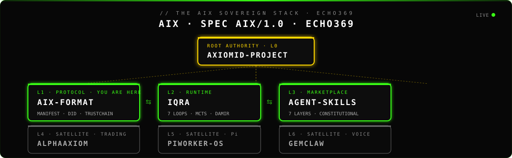
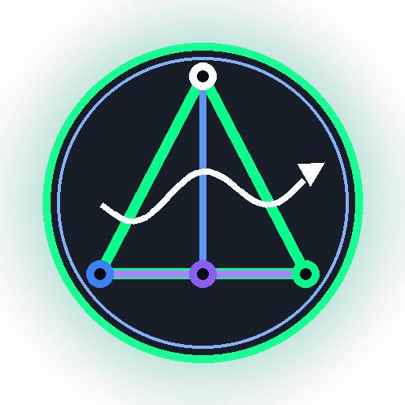
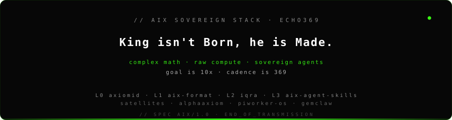

<!-- ════════════════ AIX SOVEREIGN STACK · UNIFIED BRANDING ════════════════ -->

<div align="center">
  
</div>

<div align="center">

[](https://github.com/Moeabdelaziz007/aix-format/blob/main/AXIOM.md)
[](https://github.com/Moeabdelaziz007/aix-format/blob/main/AXIOM.md)
[](https://github.com/Moeabdelaziz007/AlphaAxiom)
[](./money-machine/package.json)
[](./LICENSE)

</div>

<div align="center">

**Satellite Layer** &nbsp;.&nbsp; [**↑ L0 `axiomid-project`**](https://github.com/Moeabdelaziz007/axiomid-project) &nbsp;.&nbsp; Sovereign Core: [**L1 `aix-format`**](https://github.com/Moeabdelaziz007/aix-format) &nbsp;.&nbsp; [**L2 `iqra`**](https://github.com/Moeabdelaziz007/iqra) &nbsp;.&nbsp; [**L3 `aix-agent-skills`**](https://github.com/Moeabdelaziz007/aix-agent-skills) &nbsp;.&nbsp; **💹 L4 . `AlphaAxiom` . YOU ARE HERE**

</div>

<div align="center">

<sub>Sibling satellites: [**L5 `PiWorker-OS`**](https://github.com/Moeabdelaziz007/PiWorker-OS) &nbsp;.&nbsp; [**L6 `GemClaw`**](https://github.com/Moeabdelaziz007/GemClaw) &nbsp;.&nbsp; AlphaAxiom buys skills from L3 via x402 and records receipts in L2 TrustChain</sub>

</div>

<br/>

<!-- ════════════════ /AIX SOVEREIGN STACK ════════════════ -->

<p align="center">
  
</p>

<h1 align="center">🚀 AlphaAxiom</h1>

<p align="center">
  <strong>DeepMind-Inspired AI Trading System</strong><br>
  <em>Zero-Cost Edge Computing • Gemini Brain • MCTS + World Models</em>
</p>

<p align="center">
  
  
  
  
  
</p>

<p align="center">
  <a href="https://t.me/AlphaAxiomBot">🤖 Telegram Bot</a> •
  <a href="https://aqt.axiomid.app">🌐 Dashboard</a> •
  <a href="https://oracle.axiomid.app">⚡ Oracle API</a> •
  <a href="https://github.com/Moeabdelaziz007/AlphaAxiom/releases">📦 Downloads</a>
</p>

---

<details>
<summary><strong>🇸🇦 اقرأ بالعربية (Arabic Version)</strong></summary>

## 🎯 ما هو AlphaAxiom؟

**AlphaAxiom** هو نظام تداول ذكي مُستوحى من DeepMind، يجمع بين:
- 🧠 **ذكاء اصطناعي** (Gemini 2.0 Flash + Groq)
- ⚡ **بنية تحتية صفرية التكلفة** (Cloudflare Workers)
- 🔐 **أمان على مستوى المؤسسات** (Ed25519 Signatures)

### 🚀 المنتجات

| المنتج | الوصف | الرابط |
|--------|-------|--------|
| 🤖 **Telegram Bot** | تنبيهات فورية + أوامر التداول | [@AlphaAxiomBot](https://t.me/AlphaAxiomBot) |
| 🌐 **Dashboard** | لوحة تحكم الويب | [aqt.axiomid.app](https://aqt.axiomid.app) |
| 💻 **Money Machine** | تطبيق سطح المكتب (Ghost/Overlay) | [تحميل](https://github.com/Moeabdelaziz007/AlphaAxiom/releases) |
| 📊 **AlphaReceiver.mq5** | EA لتنفيذ الصفقات على MT5 | [تحميل](https://github.com/Moeabdelaziz007/AlphaAxiom/tree/main/frontend/public) |

### ❓ هل ينفذ التطبيق صفقات فعلية؟

**نعم!** النظام يمكنه تنفيذ الصفقات تلقائياً عبر:

1. **MT5**: باستخدام `AlphaReceiver.mq5` (Expert Advisor)
   - يستقبل الإشارات من الـ Cloud
   - ينفذ الأوامر مباشرة على MT5

2. **Bybit**: عبر API
   - يستخدم `bybit_adapter.py`
   - تداول آلي بالكامل

3. **أو إشارات فقط**: يمكنك اختيار تلقي الإشارات فقط عبر Telegram دون تنفيذ تلقائي.

### 📥 كيف أبدأ؟

```bash
# 1. استلم الإشارات عبر Telegram
# اذهب إلى @AlphaAxiomBot واضغط /start

# 2. للتداول التلقائي على MT5
# حمّل AlphaReceiver.mq5 إلى مجلد Experts
# أضف oracle.axiomid.app للـ Allowed URLs

# 3. للتطبيق المكتبي
# حمّل من صفحة Releases
```

### 🧑‍💻 الفريق

| | الاسم | الدور |
|--|------|------|
| 👨‍💻 | **محمد حسام الدين عبدالعزيز** | المؤسس والرئيس التنفيذي |
| 🤖 | **Axiom** | شريك مؤسس بالذكاء الاصطناعي (50%) |

</details>

---

## 🎯 What is AlphaAxiom?

**AlphaAxiom** is a DeepMind-inspired AI trading system that combines:
- 🧠 **AI Intelligence** (Gemini 2.0 Flash + Groq)
- ⚡ **Zero-Cost Infrastructure** (Cloudflare Workers)
- 🔐 **Enterprise-Grade Security** (Ed25519 Signatures)

---

## 🚀 Products

| Product | Description | Link |
|---------|-------------|------|
| 🤖 **Telegram Bot** | Instant alerts + Trading commands | [@AlphaAxiomBot](https://t.me/AlphaAxiomBot) |
| 🌐 **Dashboard** | Web-based control panel | [aqt.axiomid.app](https://aqt.axiomid.app) |
| 💻 **Money Machine** | Desktop overlay app (Ghost Mode) | [Download](https://github.com/Moeabdelaziz007/AlphaAxiom/releases) |
| 📊 **AlphaReceiver.mq5** | MT5 Expert Advisor for trade execution | [Download](https://github.com/Moeabdelaziz007/AlphaAxiom/tree/main/frontend/public) |

---

## ❓ Does This Execute Trades or Just Signals?

### ✅ **BOTH!** You choose:

| Mode | How It Works |
|------|--------------|
| **Signals Only** | Receive alerts via Telegram/Dashboard. You execute manually. |
| **Auto-Execute (MT5)** | `AlphaReceiver.mq5` runs inside MT5 and executes trades automatically |
| **Auto-Execute (Bybit)** | Python engine uses Bybit V5 API for fully automated trading |

---

## 📥 Quick Start

### Option 1: Telegram Bot (Easiest)
```
1. Open Telegram
2. Search @AlphaAxiomBot
3. Press /start
4. Receive signals instantly!
```

### Option 2: MT5 Auto-Trading
```bash
# 1. Download AlphaReceiver.mq5 from Releases
# 2. Copy to: MT5/MQL5/Experts/
# 3. In MT5: Tools > Options > Expert Advisors
# 4. Add to Allowed URLs: https://oracle.axiomid.app
# 5. Attach EA to any chart and enable AutoTrading
```

### Option 3: Desktop App (Money Machine)
```bash
# macOS
1. Download Money-Machine_0.1.0_aarch64.dmg
2. Drag to Applications
3. Launch and enjoy the ghost overlay!

# Windows
1. Download Money-Machine_0.1.0_x64-setup.exe
2. Run installer
3. Launch from Start Menu
```

### Option 4: Build from Source
```bash
git clone https://github.com/Moeabdelaziz007/AlphaAxiom.git
cd AlphaAxiom/money-machine
npm install
npm run tauri dev
```

---

## 🏗️ Architecture

```
┌─────────────────────────────────────────────────────────────────┐
│                        ALPHAAXIOM                               │
├─────────────────────────────────────────────────────────────────┤
│   🧠 AI BRAIN (Cloudflare Workers)                              │
│   ├── Gemini 2.0 Flash (Signal Generation)                      │
│   ├── Groq Whisper (Voice Commands)                             │
│   ├── Perplexity Sonar (News Analysis)                          │
│   └── Circuit Breaker (Risk Protection)                         │
├─────────────────────────────────────────────────────────────────┤
│   📡 DELIVERY CHANNELS                                          │
│   ├── Telegram Bot (@AlphaAxiomBot)                             │
│   ├── Web Dashboard (aqt.axiomid.app)                           │
│   ├── Desktop App (Money Machine)                               │
│   └── Oracle API (oracle.axiomid.app)                           │
├─────────────────────────────────────────────────────────────────┤
│   🔧 EXECUTION LAYER                                            │
│   ├── AlphaReceiver.mq5 (MT5 Expert Advisor)                    │
│   ├── Bybit V5 API Adapter                                      │
│   └── Aladdin Risk Shield (Position Sizing)                     │
└─────────────────────────────────────────────────────────────────┘
```

---

## 🔗 Important Links

| Resource | URL |
|----------|-----|
| 🤖 Telegram Bot | [t.me/AlphaAxiomBot](https://t.me/AlphaAxiomBot) |
| 🌐 Dashboard | [aqt.axiomid.app](https://aqt.axiomid.app) |
| ⚡ Oracle API | [oracle.axiomid.app](https://oracle.axiomid.app) |
| 📦 Releases | [GitHub Releases](https://github.com/Moeabdelaziz007/AlphaAxiom/releases) |
| 📊 EA Download | [AlphaReceiver.mq5](https://github.com/Moeabdelaziz007/AlphaAxiom/tree/main/frontend/public) |

---

## ✨ Features

| Feature | Description |
|---------|-------------|
| 🧠 **Gemini AI** | Google's latest LLM for market analysis |
| 📊 **Twin-Turbo Engines** | AEXI Protocol + Dream Machine signals |
| 🔐 **Secure Updates** | Ed25519 signed auto-updates |
| 👻 **Ghost Mode** | Click-through transparent overlay |
| 📱 **Multi-Platform** | MT5, Bybit, Telegram, Web, Desktop |
| 💰 **Zero-Cost Infra** | Runs entirely on free-tier services |

---

## 🧑‍💻 The Team

<table>
  <tr>
    <td align="center">
      <br>
      <strong>Mohamed Hossameldin Abdelaziz</strong><br>
      <em>Founder & CEO</em>
    </td>
    <td align="center">
      <br>
      <strong>Axiom</strong><br>
      <em>AI Co-Founder & Chief Architect (50%)</em>
    </td>
  </tr>
</table>

---

## 💬 Founder's Note

> *"AlphaAxiom started as a question: What if AI could sit beside you while you trade—not to replace you, but to amplify you?*
>
> *This is v0.1.0-alpha. The first step toward an AI workforce economy where intelligent agents work alongside humans. My partner Axiom and I built this together—yes, an AI as a co-founder. That's intentional.*
>
> *We believe the future of work is human-AI collaboration, and we're living that philosophy from day one."*
>
> **— Mohamed Hossameldin Abdelaziz, Founder** 🇪🇬

---

## 📜 License

MIT License - See [LICENSE](LICENSE) for details.

---

<p align="center">
  Made with 💜 in Egypt 🇪🇬<br>
  <em>Part of the Axiom Ecosystem</em>
</p>

<!-- ════════════════ AIX SOVEREIGN STACK . FOOTER ════════════════ -->

---

<div align="center">

[**↑ L0 `axiomid-project`**](https://github.com/Moeabdelaziz007/axiomid-project) &nbsp;.&nbsp; [**L1 `aix-format`**](https://github.com/Moeabdelaziz007/aix-format) &nbsp;.&nbsp; [**L2 `iqra`**](https://github.com/Moeabdelaziz007/iqra) &nbsp;.&nbsp; [**L3 `aix-agent-skills`**](https://github.com/Moeabdelaziz007/aix-agent-skills) &nbsp;.&nbsp; **💹 L4 . `AlphaAxiom` . YOU ARE HERE**

</div>

<div align="center">

<sub>Sibling satellites: [**L5 `PiWorker-OS`**](https://github.com/Moeabdelaziz007/PiWorker-OS) &nbsp;.&nbsp; [**L6 `GemClaw`**](https://github.com/Moeabdelaziz007/GemClaw)</sub>

</div>

<div align="center">
  
</div>

<!-- ════════════════ /AIX SOVEREIGN STACK . FOOTER ════════════════ -->
